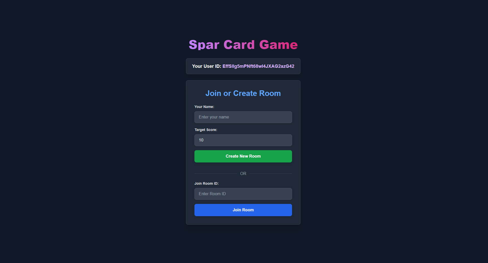

# ♠️ Spar Card Game

A real-time multiplayer card game built with **React** and **Firebase**, supporting anonymous user authentication, Firestore-based game state sync, and a simple chat system.

 

## 🔗 Live Demo

Play it here: [https://spar-84a09.web.app](https://spar-84a09.web.app)

---

## 🚀 Features

- 🃏 Real-time multiplayer card gameplay (2–7 players)
- 👻 Anonymous user login (no sign-up required)
- 🔥 Firebase Firestore for live game sync
- 💬 In-room chat support
- 🎯 Score tracking and round-based gameplay
- ✅ Game reset and room leave options
- 🎨 Responsive, modern UI with card animations

---

## 📸 Preview

<!-- Add image links if you want -->
- Lobby: player name, room creation/join
- Game board: player hands, trick area, chat
- Game flow: dealing, playing cards, scoring

---

## 🛠 Tech Stack

- **Frontend**: React (with Hooks)
- **Backend**: Firebase Firestore + Firebase Auth
- **Hosting**: Firebase Hosting
- **Style**: Tailwind CSS (utility-first styling)

---

## ⚙️ Setup & Installation

### 1. Clone the repo

```bash
git clone https://github.com/your-username/spar-card-game.git
cd spar-card-game
```

### 2. Install dependencies

```bash
npm install
```

### 3. Firebase Setup

- Create a Firebase project at firebase.google.com
- Enable Anonymous Auth in Authentication
- Set up Firestore (in test mode for development)
- Enable Firebase Hosting
- Replace firebaseConfig in App.js with your actual config:

```js
const firebaseConfig = {
  apiKey: "YOUR_API_KEY",
  authDomain: "YOUR_DOMAIN",
  projectId: "YOUR_PROJECT_ID",
  // etc.
};
```

### 4. Start the dev server

```bash
npm start
```

## 🌐 Deploy to Firebase

**One-time setup:**

```bash
npm install -g firebase-tools
firebase login
firebase init hosting
```

**Deploy:**

```bash
npm run build
firebase deploy
```

## 🔐 Firestore Rules (Recommended for Production)

```js
rules_version = '2';
service cloud.firestore {
  match /databases/{database}/documents {
    match /artifacts/{appId}/public/data/sparRooms/{roomId} {
      allow read, write: if request.auth != null;
    }
    match /artifacts/{appId}/public/data/sparRooms/{roomId}/chatMessages/{msgId} {
      allow read, write: if request.auth != null;
    }
  }
}
```

## 🧩 Folder Structure

```bash
/public         - Static assets
/src/App.js     - Main app logic
/firebase.json  - Hosting + SPA config
.firebaserc     - Project alias
```

## 🧠 Known Issues / To-Do

- [ ] Responsive tweaks for small mobile screens
- [ ] Game history or replay feature
- [ ] Spectator mode
- [ ] Better error handling for network drops

## 📄 License

MIT License. Feel free to fork, extend, or use for your own projects.

## 🙌 Acknowledgments

- Firebase team for powerful dev tools
- Tailwind CSS for styling utilities
- You, the player! ♠️♥️♣️♦️